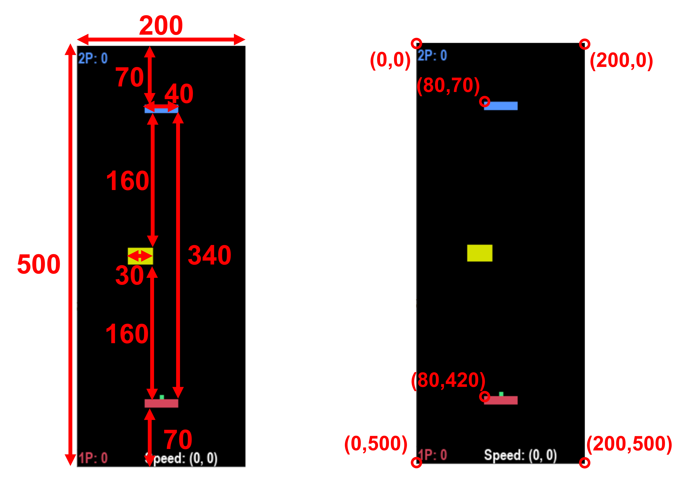

# 乒乓球


[](https://www.python.org/downloads/release/python-390/)
[](https://github.com/PAIA-Playful-AI-Arena/MLGame)
[](https://github.com/pygame/pygame/releases/tag/2.0.1)

這是一個經典的乒乓球小遊戲


---
# 基礎介紹

## 啟動方式

- 直接啟動 [main.py](main.py) 即可執行

### 遊戲參數設定

```python
# main.py 
game = PingPong(difficulty="EASY", game_over_score=5)
```

- `difficulty`：遊戲難度
    - `EASY`：簡單的乒乓球遊戲
    - `NORMAL`：加入切球機制
    - `HARD`：加入切球機制與障礙物
- `game_over_score [選填]`：指定遊戲結束的分數。當任一方得到指定的分數時，就結束遊戲。預設是 3，但如果啟動遊戲時有指定 -1 選項，則結束分數會是 1。

## 玩法

- 將球發往左邊/右邊
  - 1P:  `.`、`/`
  - 2P:  `Q`、`E`
- 移動板子
  - 1P: 左右方向鍵
  - 2P: `A`、`D`

1P 在下半部，2P 在上半部

## 目標

1. 讓對手沒接到球

### 通關條件

1. 自己的分數達到 `game_over_score`。

### 失敗條件

1. 對手的分數達到 `game_over_score`。

### 平手條件

1. 球速超過 `40`

## 遊戲系統

1. 遊戲物件
   - 球
     - 綠色正方形
     - 每場遊戲開始時，都是由 1P 先發球，之後每個回合輪流發球
     - 球由板子的位置發出，可以選擇往左或往右發球。如果沒有在 150 影格內發球，則會自動往隨機一個方向發球
     - 初始球速是每個影格 (±7, ±7)，發球後每 100 影格增加 1

   - 板子
     - 矩形，1P 是紅色的，2P 是藍色的
     - 板子移動速度是每個影格 (±5, 0)
     - 1P 板子的初始位置在 (80, 420)，2P 則在 (80, 70)

   - 障礙物
     - 黃色矩形
     - x 初始位置在 0 到 180 之間，每 20 為一單位隨機決定，y 初始位置固定在 240，移動速度為每影格 (±5, 0)
     - 障礙物會往復移動，初始移動方向是隨機決定的
     - 障礙物不會切球，球撞到障礙物會保持球的速度
    
     障礙物加入在 `HARD` 難度中。

2. 行動機制
    
    左右移動板子，每次移動 5px
    
3. 座標系統 (物件座標皆為左上角座標)
    - 螢幕大小 200 x 500
    - 板子 40 x 30
    - 球 5 x 5
    - 障礙物 30 x 20
    
4. 切球機制
 
    在板子接球時，球的 x 方向速度會因為板子的移動而改變：

    - 如果板子與球往同一個方向移動時，球的 x 方向速度會增加 3 (只增加一次)
    - 如果板子沒有移動，則球的 x 方向速度會恢復為目前的基礎速度
    - 如果板子與球往相反方向移動時，球會被打回原來過來的方向，其 x 方向速度恢復為目前的基礎速度
 
    切球機制加入在 `NORMAL` 與 `HARD` 難度中。
---

# 進階說明

## 使用ＡＩ玩遊戲

```bash
# python MLGame.py <options> pingpong <difficulty> [game_over_score]
# before MLGame 9.1.*
python MLGame.py -i ml_play_template.py pingpong EASY 3

# Begin from MLGame 9.2.*
python MLGame.py -i ml_play_template_1P.py -i ml_play_template_2P.py -f 120 \
pingpong --difficulty HARD --game_over_score 5
```

遊戲參數依序是 [`difficulty`] [`game_over_score`]

## ＡＩ範例


```python
class MLPlay:
    def __init__(self, side):
        """
        Constructor

        @param side A string "1P" or "2P" indicates that the 
        `MLPlay` is used by
               which side.
        """
        self.ball_served = False
        self.side = side

    def update(self, scene_info):
        """
        Generate the command according to the received scene
        information
        """
        # print(scene_info)
        if scene_info["status"] != "GAME_ALIVE":
            return "RESET"

        if not self.ball_served:
            self.ball_served = True
            return "SERVE_TO_RIGHT"
        else:
            return "MOVE_RIGHT"

    def reset(self):
        """
        Reset the status
        """
        print("reset "+self.side)
        self.ball_served = False
```

#### 初始化參數
- side: 字串。其值只會是 `"1P"` 或 `"2P"`，代表這個程式被哪一邊使用。

## 遊戲資訊

- scene_info 的資料格式如下

```json
{
    "frame": 42,
    "status": "GAME_ALIVE",
    "ball": [189, 128],
    "ball_speed": [7, -7],
    "platform_1P": [0, 420],
    "platform_2P": [0, 50],
    "blocker": [50, 240]
}
```

- `frame`：遊戲畫面更新的編號
- `status`：字串。目前的遊戲狀態，會是以下的值其中之一：
  - `GAME_ALIVE`：遊戲正在進行中
  - `GAME_1P_WIN`：這回合 1P 獲勝
  - `GAME_2P_WIN`：這回合 2P 獲勝
  - `GAME_DRAW`：這回合平手
- `ball` `(x, y)` tuple。球的位置。
- `ball_speed`：`(x, y)` tuple。目前的球速。
- `platform_1P`：`(x, y)` tuple。1P 板子的位置。
- `platform_2P`：`(x, y)` tuple。2P 板子的位置。
- `blocker`：`(x, y)` tuple。障礙物的位置。如果選擇的難度不是 `HARD`，則其值為 `None`。

## 動作指令

- 在 update() 最後要回傳一個字串，主角物件即會依照對應的字串行動，一次只能執行一個行動。
    - `SERVE_TO_LEFT`：將球發向左邊
    - `SERVE_TO_RIGHT`：將球發向右邊
    - `MOVE_LEFT`：將板子往左移
    - `MOVE_RIGHT`：將板子往右移
    - `NONE`：無動作

## 遊戲結果

- 最後結果會顯示在 console 介面中，若是 PAIA 伺服器上執行，會回傳下列資訊到平台上。

```json
{
  "frame_used": 54,
  "state": "FINISH",
  "attachment": [
    {
      "player": "ml_1P",
      "rank": 1,
      "score": 1,
      "status": "GAME_PASS",
      "ball_speed": [
        7,
        -7
      ]
    },
    {
      "player": "ml_2P",
      "rank": 2,
      "score": 0,
      "status": "GAME_OVER",
      "ball_speed": [
        7,
        -7
      ]
    }
  ]
}
```

- `frame_used`：表示使用了多少個 frame
- `state`：表示遊戲結束的狀態
    - `FAIL`：遊戲結束
    - `FINISH`：遊戲完成
- `attachment`：紀錄遊戲各個玩家的結果與分數等資訊
    - `player`：玩家編號
    - `rank`：排名
    - `score`：各玩家獲勝的次數
    - `status`：玩家的狀態
      - `GAME_PASS`：該玩家獲勝
      - `GAME_OVER`：該玩家失敗
      - `GAME_DRAW`：雙方平手
    - `ball_speed`：球的速度

## 機器學習模式的玩家程式

乒乓球是雙人遊戲，所以在啟動機器學習模式時，可以利用 `-i <script_for_1P> -i <script_for_2P>` 指定兩個不同的玩家程式。如果只有指定一個玩家程式，則兩邊都會使用同一個程式。

而在遊戲中有提供 `ml_play_manual.py` 這個程式，它會建立一個手把，讓玩家可以在機器學習模式中手動與另一個程式對玩。使用流程：

1. 使用 `python MLGame.py -i ml_play_template.py -i ml_play_manual.py pingpong <difficulty>` 啟動遊戲。會看到有兩個視窗，其中一個就是手把。終端機會輸出 "Invisible joystick is used. Press Enter to start the 2P ml process." 的訊息。


2. 將遊戲手把的視窗拉到一旁，並且讓它是目標視窗 (也就是說視窗的標題不是灰色的)。


3. 按 Enter 鍵讓手把也發出準備指令以開始遊戲，使用左右方向鍵來控制板子移動。

## 關於球的物理

如果球撞進其他遊戲物件或是遊戲邊界，球會被直接「擠出」到碰撞面上，而不是補償碰撞距離給球。


---
